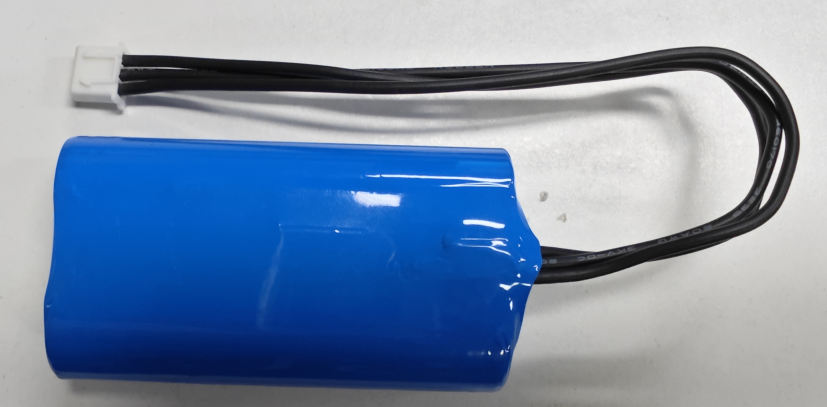

# About the battery

The documented Robot HAT battery input accepts a balanced two-cell lithium-ion
pack in the 6.0-to-8.4-volt range through an XH2.54 three-pin connector.

## Image: Balanced battery pack

## Electrical characteristics

| Property | Documented value |
|---|---:|
| Cell count | Two 18650 cells |
| Nominal capacity | 2,000 milliampere-hours |
| Energy | 14.8 watt-hours |
| Connector | XH2.54 three-pin |
| Over-discharge protection | 6.0 volts |

ADC channel A4 measures the divided battery voltage. The board uses a
20-kilohm and 10-kilohm divider, so the battery voltage is three times the ADC
pin voltage. `XWalkBoardControl::batteryVoltage()` performs this conversion.

Use a compatible balanced pack and never treat software measurement as the
only battery-protection layer.
