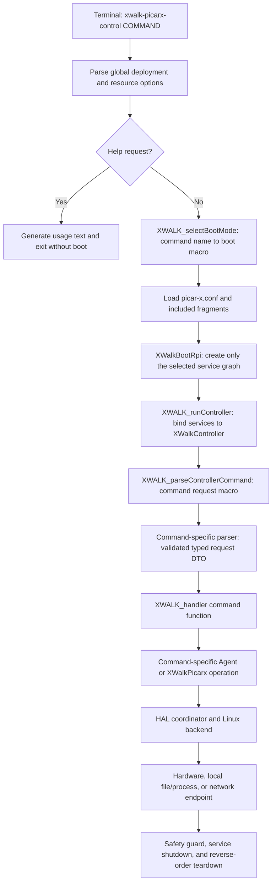
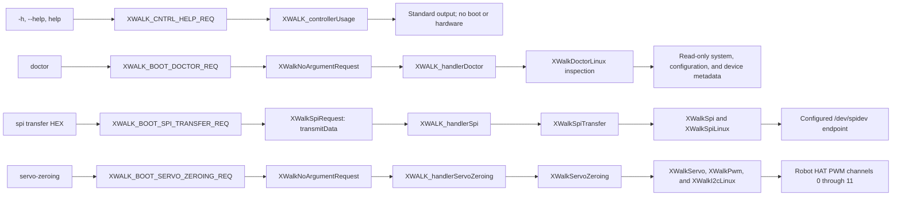
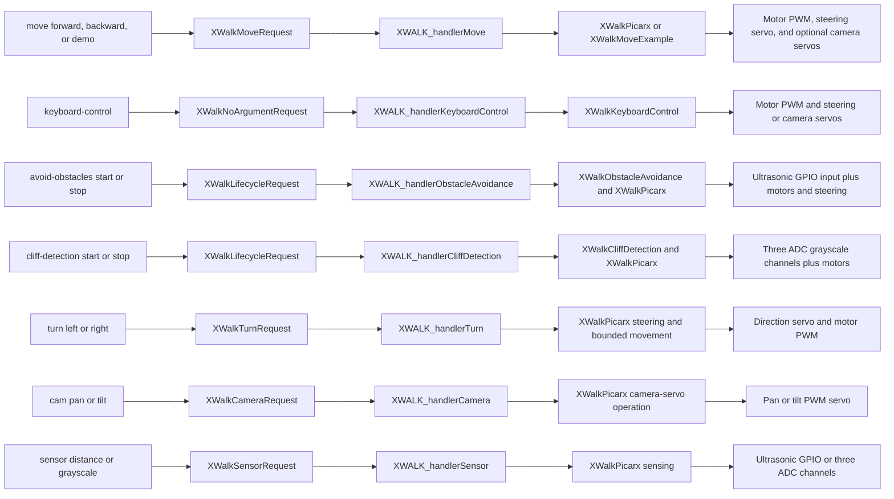
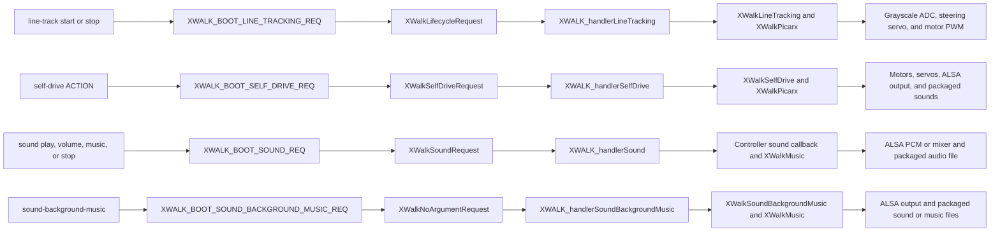
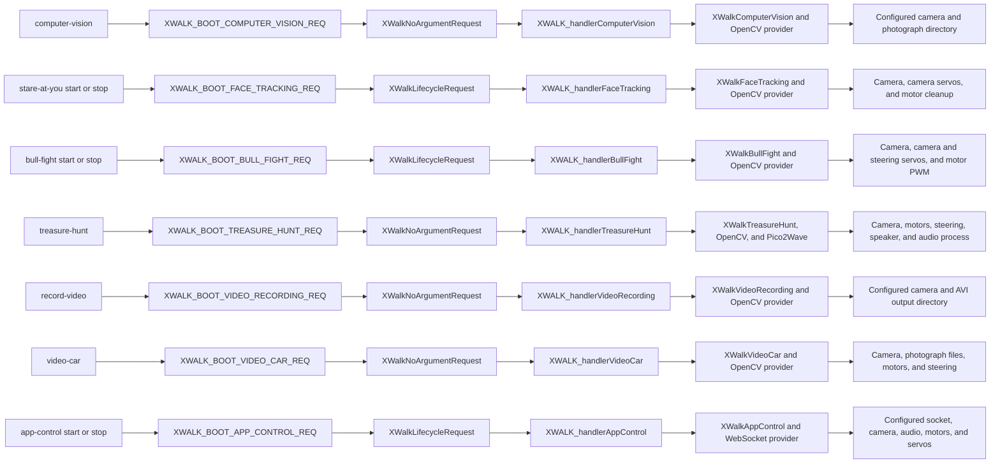
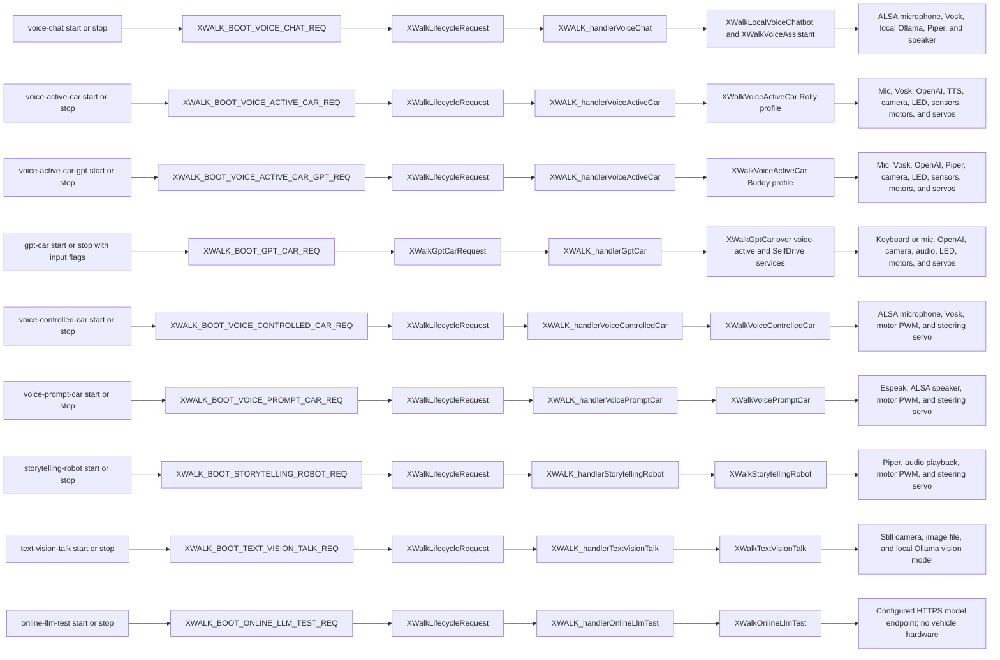
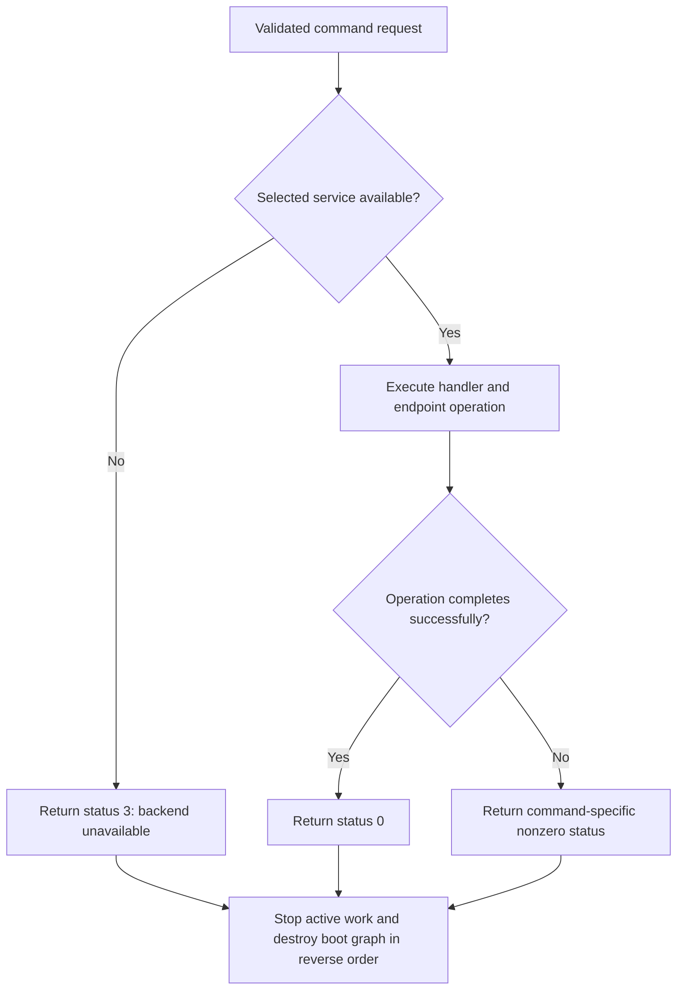

# xWalk Controller Command Flow

This document traces every `xwalk-picarx-control` command from terminal input to its final Raspberry Pi
hardware, local service, file, or network boundary. It reflects the current Controller, Agent, boot, and HAL
composition.

The host executable follows the same parsing and handler path but uses host-owned test or stub services. Only
the Raspberry Pi executable creates Linux hardware backends.

## Common Raspberry Pi path

Help is handled before boot and therefore claims no device. Every other command first selects its minimum boot
graph from the command name. The complete command is converted into a typed request only after the selected
services are alive inside the synchronous boot callback.

Invalid global options stop before boot. An unsupported command, malformed payload, out-of-range value, or
missing command-specific service stops before the requested operation reaches its endpoint. Commands using the
PiCar-X graph also receive a command-scope emergency-stop guard.

The current boot selector returns `XWALK_BOOT_BASE_REQ` for an empty or unknown command name. Consequently, the
RPi executable can construct the base hardware graph before the typed parser rejects that command. This is a
known command-boundary limitation; only supported command names should be passed to a deployed controller.

## Platform and isolated-service commands

These commands deliberately bypass the complete PiCar-X motor graph unless their documented service needs it.

`doctor` may open configured descriptors and read metadata, firmware, or battery information. It does not reset
the MCU, request output GPIO lines, transfer SPI payloads, enable audio, capture media, or contact a model.

## Direct vehicle and sensor commands

These commands use `XWALK_BOOT_BASE_REQ` unless a specialized graph is shown. Their typed requests prevent raw
command strings from reaching PiCar-X or HAL objects.

## Autonomous vehicle and media commands

## Vision and connectivity commands

## Voice and language-model commands

Credentials are read only from the configured environment-variable names. Secret values never become request
DTO members and are not displayed by these paths.

## Calibration command

Calibration uses the base PiCar-X boot graph. It may move actuators and motors, read sensors, and persist
validated values through `XWalkConfigStore`.

```mermaid
flowchart LR
    calibration["calibrate, calibrate grayscale, or calibrate servo-motor"]
    calibrationBoot["XWALK_BOOT_BASE_REQ"]
    calibrationReq["XWalkCalibrationRequest"]
    calibrationHandler["XWALK_handlerCalibration"]
    calibrationAgents["GrayscaleCalibration and ServoMotorCalibration"]
    calibrationHal["XWalkPicarx, ADC, PWM, servo, motor, and ConfigStore"]
    calibrationOut["Physical checks plus persisted calibration overrides"]

    calibration --> calibrationBoot --> calibrationReq --> calibrationHandler
    calibrationHandler --> calibrationAgents --> calibrationHal --> calibrationOut
```

The complete calibration flow is safety-sensitive. Motor-direction verification must be performed with the
vehicle raised so its wheels cannot contact the ground.

## Terminal outcomes

Exceptions from validation or backend failures propagate to the process boundary after automatic objects begin
their reverse-order cleanup. PiCar-X command paths additionally use the emergency-stop safety guard.
