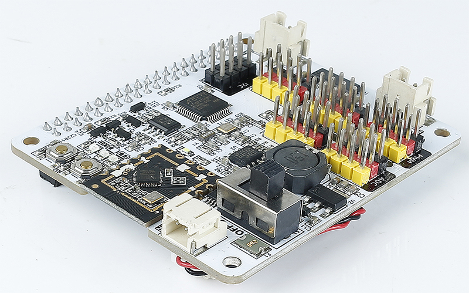

# Features

xWalk Firmware provides C++17 hardware-abstraction components for Robot HAT
boards. The current implementation includes:

- callback-driven I2C and optional Linux I2C ownership;
- digital GPIO, polarity, edge handling, and optional Linux GPIO ownership;
- 12-bit ADC acquisition and voltage conversion;
- shared-timer PWM output and servo control;
- single and paired motor control;
- ultrasonic, ADXL345, grayscale, and line-tracking sensors;
- GPIO and RGB LEDs, buzzer, button, speaker, and music coordination;
- board discovery, MCU reset, battery measurement, and firmware information;
- configuration persistence, tracing, utilities, speech, model, and voice
  assistant coordination.

Hardware-independent components receive caller-created dependencies and do not
claim Linux devices, network clients, models, files, or audio devices implicitly.
