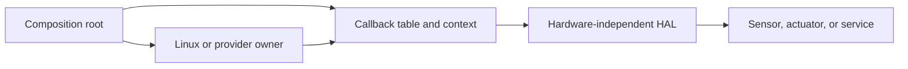
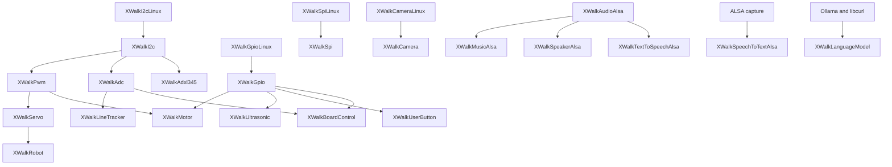

# xWalk HAL hardware and backend architecture

**Project:** xWalk Firmware

**Target:** Raspberry Pi with SunFounder Robot HAT

**Document date:** 2026-08-01

**Status:** Current implementation

## 1. Purpose

This document describes how xWalk reaches physical hardware and external providers. It covers Linux resource
ownership, Robot HAT protocols, board-specific composition, audio, speech, model backends, lifecycle rules,
and safe verification.

For the layer overview, see [xWalk High-Level Architecture](HAL%20Arcithure.md). For application exposure, see
[CLI Architecture](CLI%20Architecture.md).

## 2. Backend design pattern

Hardware-independent modules store an opaque, non-owning context and a validated callback table. Concrete
backends own Linux or provider resources and expose callback bridges.



The composition root creates owners before consumers. A core object never deletes the context or opens a
target resource. Destruction proceeds from the highest-level consumer back to the owner.

## 3. Concrete backend inventory

| Backend target | Owner or adapter | Resource or provider |
| --- | --- | --- |
| `xWalkI2cLinux` | `XWalkI2cLinux` | Linux `i2c-dev`, normally `/dev/i2c-1` |
| `xWalkGpioLinux` | `XWalkGpioLinux` | Linux GPIO character device, normally `/dev/gpiochip0` |
| `xWalkSpiLinux` | `XWalkSpiLinux` | Linux `spidev`, configured explicitly |
| `xWalkCameraLinux` | `XWalkCameraLinux` | CSI through `rpicam-still` or USB through V4L2 and `ffmpeg` |
| `xWalkAudioAlsa` | `XWalkAudioAlsa` | ALSA playback PCM streams and one mixer |
| `xWalkMusicAlsa` | `XWalkMusicAlsa` | Music decoding and shared-audio callback adapter |
| `xWalkSpeakerAlsa` | `XWalkSpeakerAlsa` | Bounded file decoding and shared-audio adapter |
| `xWalkSpeechToTextAlsa` | `XWalkSpeechToTextAlsa` | ALSA capture plus injected recognizer |
| `xWalkTextToSpeechAlsa` | `XWalkTextToSpeechAlsa` | Injected synthesizer plus shared ALSA playback |
| `xWalkLanguageModelOllama` | `XWalkLanguageModelOllama` | Ollama JSON over libcurl HTTP transport |
| `xWalkUtilsLinux` | `XWalkUtilsLinux` | Linux terminal, process, network, user, and descriptor services |

Device-tree discovery is implemented directly by `XWalkDevice` through filesystem wrappers. It is read-only
and does not need a separate Linux backend target.

## 4. Hardware dependency graph



## 5. Raspberry Pi and Robot HAT boundary

The Device Tree overlay is boot-time kernel configuration. It may expose I2C, SPI, I2S, GPIO, HAT metadata,
and an ALSA sound card, but it does not provide application ownership or HAL behavior.

Only the overlay for the physically connected board should be active. Deployment must confirm:

- the selected Robot HAT revision and UUID;
- I2C bus and expected addresses;
- GPIO controller path and line numbering;
- ALSA PCM, mixer, and playback element names;
- group membership and permissions for I2C, GPIO, and audio devices;
- pin conflicts with overlay-owned audio control lines.

`XWalkSpiLinux` consumes one explicitly configured SPI device. The SPI-only CLI
boot mode does not initialize the Robot HAT or any unrelated device.

## 6. I2C backend

### 6.1 Ownership

`XWalkI2cLinux` owns one Linux I2C file descriptor. `XWalkI2c` stores a non-owning pointer to that backend and
the probe, write-register, raw-read, and read-register callbacks.

The default device is `/dev/i2c-1`, but boot reads a deployment-selected path. Complete logical transactions are
serialized so another operation cannot change the selected slave between register selection and data transfer.

### 6.2 Consumers

The I2C backend supports:

- Robot HAT PWM and ADC commands;
- direct ADXL345 register access;
- firmware-version acquisition;
- servo, motor, RGB LED, passive buzzer, line tracker, robot, and board composition.

### 6.3 Addresses

Robot HAT modules normally probe supported MCU addresses `0x14`, `0x15`, and, where declared by the module,
`0x16`. ADXL345 uses seven-bit address `0x53` by default.

## 7. GPIO backend

### 7.1 Ownership

One `XWalkGpioLinux` instance owns one claimed Linux GPIO line and any associated event worker. `XWalkGpio`
contains logical name mapping, direction, polarity, pull, edge, debounce, and callback dispatch.

The current default is `/dev/gpiochip0` and the Linux GPIO character-device ABI version 1. Boot passes the
configured path to every owner. Optional exact kernel name and label checks plus a minimum required line count
reject a mismatched controller before any line claim. No backend scans or selects the first chip automatically.

### 7.2 Consumers

GPIO-backed consumers include:

- ultrasonic trigger and echo;
- active buzzer and single-color LED;
- user-button input and event monitoring;
- legacy motor direction lines;
- MCU reset and speaker-enable lines;
- other caller-selected digital pin operations.

Interrupt callbacks must remain short. They must not perform blocking storage, model, speech, or playback
work.

## 8. Robot HAT MCU peripherals

### 8.1 ADC

`XWalkAdc` supports public channels A0 through A7. Hardware mapping uses `7 - channel`, and acquisition uses
command base `0x10`. One sample is a two-byte most-significant-byte-first 12-bit value. Conversion uses a
3.3-volt reference and raw range zero through 4095.

The PiCar-X graph uses A0, A1, and A2 for the grayscale module. Board battery measurement uses A4 and applies
the documented three-to-one divider.

### 8.2 PWM

`XWalkPwm` supports P0 through P19. Output registers start at `0x20`. Prescaler registers use the `0x40` and
`0x50` families, and period registers use the `0x44` and `0x54` families. Calculations use the 72-megahertz
PWM clock.

One caller-owned `XWalkPwmTimerState` represents timer-wide coupling:

| Timer | Channels |
| ---: | --- |
| 0 | P0 through P3 |
| 1 | P4 through P7 |
| 2 | P8 through P11 |
| 3 | P12 through P15 |
| 4 | P16 and P17 |
| 5 | P18 |
| 6 | P19 |

Channels sharing a timer must use compatible frequency and period configuration.

## 9. Servo and motor composition

### 9.1 Servo

The default servo contract uses 50 Hertz, a 4095-count period, angles from -90 through 90 degrees, and pulse
widths from 500 through 2500 microseconds. Mechanical limits can be narrower than the electrical contract.

The current PiCar-X composition assigns P0 to camera pan, P1 to camera tilt, and P2 to steering.

### 9.2 Motor modes

`XWalkDevice` selects motor composition by detected board information:

| Board mode | Left motor | Right motor | Direction ownership |
| --- | --- | --- | --- |
| Legacy Robot HAT | P13 plus D4 | P12 plus D5 | Two Linux GPIO lines |
| Robot HAT v5 | P12 and P13 | P14 and P15 | Dual PWM, no direction GPIO |

Motor construction must begin from a stopped output. Confirm physical port assignment and polarity with wheels
raised before enabling movement.

## 10. Sensors

### 10.1 Grayscale and line tracker

`XWalkGrayscaleModule` observes three caller-owned ADC channels in left, middle, and right order.
`XWalkLineTracker` adds reference calibration, binary status, cliff detection, and line-position estimation.

### 10.2 Ultrasonic

`XWalkUltrasonic` uses separate trigger and echo GPIO objects. The PiCar-X application selects D2 and D3. The
default echo timeout is 20 milliseconds, timeout retries are bounded, and distance is reported in centimeters.

### 10.3 ADXL345

`XWalkAdxl345` reads little-endian signed axis samples from registers `0x32`, `0x34`, and `0x36`, then scales
them at 256 counts per standard gravity. It is implemented and hardware-buildable but not composed by the CLI.

### 10.4 User button

`XWalkUserButton` monitors an active-low pull-up GPIO with a 50-millisecond polling interval. It owns its
monitor worker but not the GPIO or callback contexts. Stop and destruction join the worker.

## 11. LEDs and buzzers

`XWalkLed` drives one logical GPIO output. `XWalkRgbLed` coordinates three PWM channels and validates the full
color request before changing outputs.

`XWalkBuzzer` supports active GPIO and passive PWM variants. The passive variant uses 50 percent duty while
active and supports bounded frequency and duration playback. Construction requests the inactive state.

Neither module is currently composed by the CLI.

## 12. Board control and discovery

`XWalkDevice` reads direct children under the configured firmware device-tree root and recognizes supported
HAT metadata. Robot HAT v5 UUID `9daeea78-0000-076e-0032-582369ac3e02` selects speaker GPIO12 and motor
mode 2.
The legacy fallback selects speaker GPIO20 and motor mode 1.

`XWalkBoardControl` coordinates:

- MCU reset through logical `MCURST`, mapped to GPIO5 in the PiCar-X composition;
- battery voltage through ADC A4;
- board-selected speaker-enable GPIO;
- an injected speaker-prime callback;
- explicit speaker disable.

The reset GPIO backend is temporary in the CLI because a later legacy motor may claim the same physical line.
The temporary graph is destroyed before long-lived motor construction.

`XWalkFirmwareInfo` reads exactly three bytes from register `0x05` and formats `major.minor.patch`.

## 13. Shared ALSA architecture

### 13.1 Audio owner

`XWalkAudioAlsa` opens one configured mixer during construction and owns up to eight PCM playback handles. Its
public operations are mutex-serialized. It validates format, rate, one-through-eight channels, period size up
to 4096 frames, latency, frame alignment, and payload bounds.

The backend supports signed 16-bit little-endian and 32-bit floating-point little-endian PCM. Short writes are
completed and underrun recovery is bounded to three attempts. Destruction closes streams and the mixer.

PCM, mixer, and element defaults are `default`, `default`, and `PCM`; deployment should select explicit names
after checking `aplay -l`, `aplay -L`, and `amixer scontrols`.

### 13.2 Music adapter

`XWalkMusicAlsa` maps the `XWalkMusicCallbacks` table to the shared audio owner. It handles sound-effect and
music-file decoding, transport control, mixer volume, and signed 16-bit mono tones.

The CLI creates this graph only for `self-drive` so horn and engine-start actions can use ALSA.

### 13.3 Speaker adapter

`XWalkSpeakerAlsa` decodes supported files in bounded chunks and supplies samples to `XWalkSpeaker` through
the shared audio owner. The neutral speaker limits active tasks to eight and write batches to 1024 frames.

The adapter and tests exist, but the Raspberry Pi CLI still installs an unavailable callback for its
standalone `sound` command.

## 14. Speech backends

### 14.1 Speech to text

`XWalkSpeechToTextAlsa` owns bounded ALSA microphone capture and delegates recognition to an application
recognizer. `XWalkSpeechToText` exposes readiness, bounded listen, file transcription, and stop.

Microphone device, sample contract, recognizer, credentials, and privacy policy are deployment configuration.

### 14.2 Text to speech

`XWalkTextToSpeechAlsa` delegates synthesis to an application-selected provider, validates returned PCM, and
writes it through `XWalkAudioAlsa`. `XWalkTextToSpeech` separately receives `XWalkBoardControl`, keeping
speaker power sequencing outside the synthesis provider.

Both backend targets and deterministic tests exist. Neither is composed by the current CLI.

## 15. Language-model backend

`XWalkLanguageModel` is provider-neutral. It forwards instructions, welcome text, bounded history operations,
messages, optional image paths, and prompts through callbacks.

`XWalkLanguageModelOllama` provides the current concrete backend. It owns model selection, bounded history,
optional image encoding, JSON conversion, libcurl HTTP transport, and provider error mapping. Endpoint, model,
timeouts, request limits, and network policy must be selected by deployment. It is not composed by the CLI.

## 16. Voice-assistant composition

One complete backend graph is constructed in this order:

1. Shared `XWalkAudioAlsa` owner.
2. `XWalkSpeechToTextAlsa`, then neutral `XWalkSpeechToText`.
3. `XWalkLanguageModelOllama`, then neutral `XWalkLanguageModel`.
4. `XWalkTextToSpeechAlsa`, then neutral `XWalkTextToSpeech` with board control.
5. `XWalkCameraLinux`, `XWalkCamera`, and the camera Agent for voice-active modes.
6. `XWalkVoiceAssistant` last.

The coordinator owns no microphone, model, network, speaker, trigger, or thread. It performs one synchronous
round. Wake word and continuous scheduling remain application concerns. The
voice-active CLI supplies image capture through the camera Agent.

The full stack is covered by deterministic composition tests and opt-in bounded target tests. The CLI composes
it for voice-chat and voice-active command groups.

## 17. Linux utility backend

`XWalkUtilsLinux` supplies ANSI output, PCM volume through `amixer`, shell-compatible command execution,
direct `PATH` lookup, interface enumeration, effective-user lookup, and standard-error restoration.

It never invokes `sudo`. Command text retains shell interpretation, so applications must validate and
allowlist untrusted input before execution. The current CLI uses its own console and delay functions without
composing this backend.

## 18. Configuration, diagnostics, and storage

`XWalkConfig` and `XWalkConfigStore` own filesystem paths and serialize operations performed through one
object.
They use same-directory replacement for updates and do not invoke privileged permission commands.

`XWalkTrace` forwards accepted severity records synchronously to an injected output callback. It has no
physical backend and introduces no global logger.

These modules need deployment-owned writable paths and application-level synchronization when multiple objects
or processes share one file.

## 19. Resource lifetime and shutdown

The required shutdown order is:

1. Stop foreground loops and reject new commands.
2. Stop voice, recognition, button, speaker, and other workers.
3. Stop motors, disable active outputs, and close feature streams.
4. Destroy Agent and service coordinators.
5. Destroy sensors and actuators.
6. Destroy GPIO and I2C front ends.
7. Close ALSA, GPIO, I2C, network, and provider owners last.

No worker may outlive its callback context. No destructor callback may throw.

## 20. Verification architecture

Every hardware-facing module has deterministic host coverage, a disabled-by-default target option, or both.
Software tests inject system-operation seams and do not require devices.

Hardware builds may open or mutate resources when executed. Ordinary verification must only compile and list:

```bash
ctest --test-dir <rpi-build-directory> -N -L hardware
```

Never execute a hardware-labelled test without explicit approval and the correct safe physical setup.

## 21. Backend coverage summary

| Area | Implementation status | CLI status |
| --- | --- | --- |
| I2C and GPIO | Linux owners implemented | Used by PiCar-X commands |
| SPI | Linux owner implemented | Used by `spi transfer` |
| PWM, ADC, servo, motor | Implemented over I2C and GPIO | Used through PiCar-X |
| Board discovery and reset | Implemented | Discovery and reset used at boot |
| Shared ALSA | Implemented | Used by sound, self-drive, and voice commands |
| Music ALSA | Implemented | Used by sound, self-drive, and voice-active actions |
| Speaker ALSA | Implemented | Not connected to standalone `sound` |
| Speech to text | ALSA capture and Vosk provider implemented | Used by voice commands |
| Text to speech | Espeak synthesis and ALSA playback implemented | Used by voice commands |
| Language model | Ollama and OpenAI-compatible HTTP backend | Used by voice-chat and voice-active commands |
| Voice assistant | Full composition tested | Used by voice-chat and voice-active commands |
| Camera capture | CSI and USB Linux providers implemented | Used by voice-active commands |
| Utils Linux | Implemented | Not composed |
| ADXL345, LED, buzzer, robot, button | Hardware path implemented | No CLI commands |

## 22. Deployment checklist

- Confirm the connected HAT revision and active Device Tree overlay.
- Confirm `/dev/i2c-*`, `/dev/gpiochip*`, ALSA names, and access permissions.
- Confirm Robot HAT MCU and ADXL345 addresses before direct sensor tests.
- Confirm GPIO line mappings and overlay conflicts.
- Raise wheels and clear steering and camera travel before actuator tests.
- Start audio at conservative volume and use bounded fixtures.
- Approve microphone privacy and model endpoint policy before speech tests.
- Keep credentials outside source, command output, and normal diagnostics.
- Validate one backend at a time before combined application testing.

## 23. Aggregate hardware status

The aggregate CMake graph references only modules present in the workspace. Raspberry Pi mode enables Linux
I2C and GPIO, ALSA audio, native decoding, Vosk recognition, Espeak synthesis, and Ollama integration.
