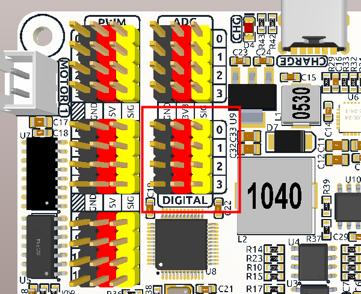
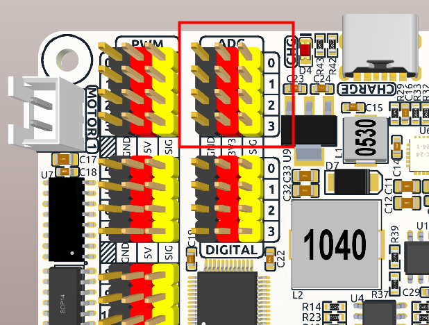
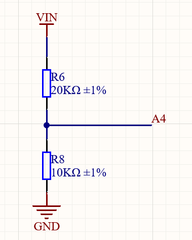
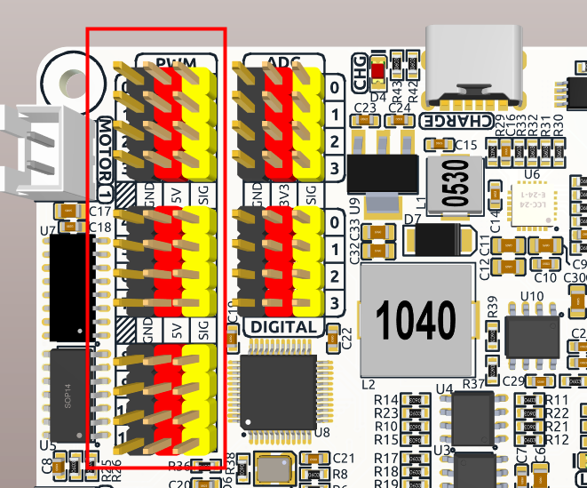
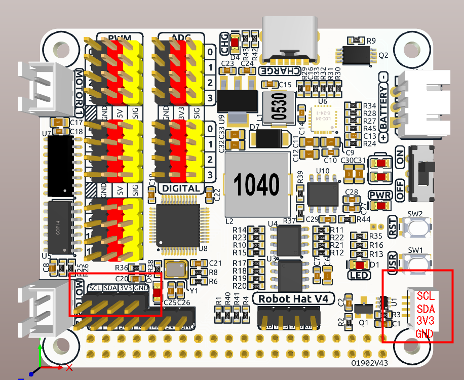
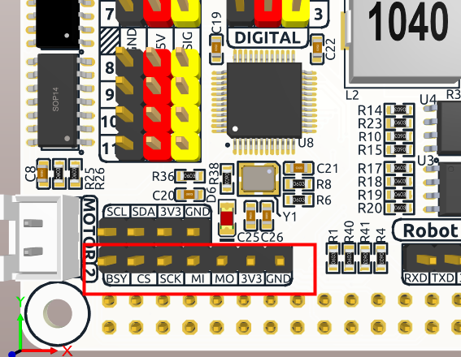
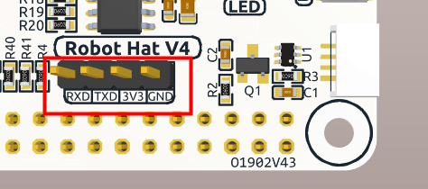

# Hardware introduction

## Robot HAT pinout

## Digital I/O

The board exposes four three-pin digital connectors. `XWalkGpio` provides the
hardware-independent C++ interface. `XWalkGpioLinux` optionally owns Linux GPIO
resources. Named board-pin mappings and polarity are defined by the C++ module.

## Image: Digital connectors

## ADC

Four external channels provide 12-bit measurements in the range 0 to 4095.
Inputs use a 3.3-volt reference. A4 is reserved for divided battery voltage.
Use `XWalkAdc` for raw samples and voltage conversion.

## Image: ADC connectors

## Image: Battery ADC divider

## PWM

The onboard MCU supplies PWM outputs. Use `XWalkPwmTimerState` to coordinate
timer settings and create one `XWalkPwm` per output. Channels on the same timer
share frequency and period settings.

## Image: PWM connectors

## I2C

The board exposes P2.54 and SH1.0 I2C connectors connected to Raspberry Pi
GPIO2 for SDA and GPIO3 for SCL. Use `XWalkI2c` with an application-created
backend. The onboard MCU normally responds at 7-bit address `0x14`.

## Image: I2C connectors

## SPI and UART

SPI and UART are Raspberry Pi expansion interfaces. The xWalk HAL provides the
bounded `XWalkSpi` transaction interface and the Linux `XWalkSpiLinux` spidev
backend. UART does not currently have a dedicated HAL class, so applications
must own that backend.

## Image: SPI connector

## Image: UART connector

## Buttons, LED, and speaker

Use `XWalkUserButton` for active-low press timing and `XWalkLed` for the user
LED. `XWalkBoardControl` controls speaker power; `XWalkSpeaker`, `XWalkMusic`,
and xWalkGPT components coordinate audio facilities. The RPi voice-prompt graph
retains board control and the speaker-enable GPIO until Espeak PCM playback has
completed.

## Motor ports

The board provides two motor channels. `XWalkDevice` selects the supported
motor mode for the detected revision. `XWalkMotor` controls one channel and
`XWalkMotors` validates coordinated commands before changing either output.
