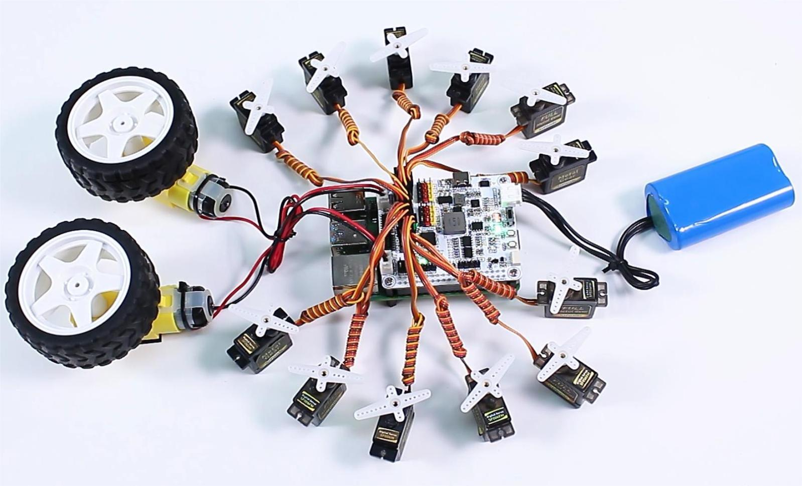

# Control servos and motors

Create the I2C backend, I2C interface, PWM timer states, PWM channels, servos,
and motors in that order. Coordinated servo motion belongs to `XWalkRobot`;
paired motor validation belongs to `XWalkMotors`.

## Image: Servo and motor arrangement

Servo channels normally require 50 hertz. Do not place a changing-frequency
load on the same timer. Sequence high-current startup and restrain the vehicle
before hardware testing.
