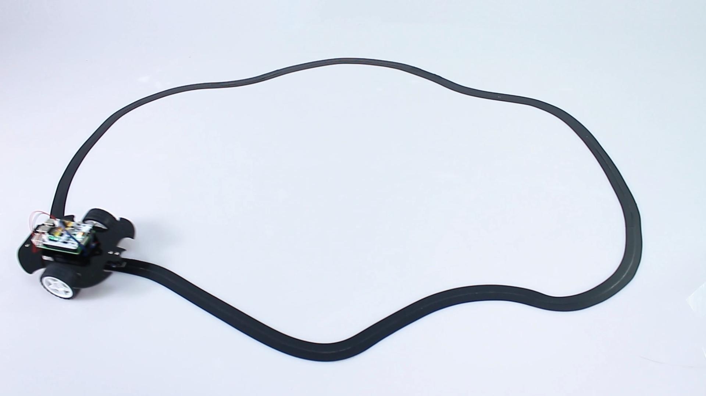

# C++ line-following car

Create three `XWalkAdc` objects, `XWalkGrayscaleModule`, `XWalkLineTracker`, two
`XWalkMotor` objects, and one `XWalkMotors` coordinator.

## Image: Line-following vehicle

Each bounded control cycle should read calibrated values, classify sensor state,
calculate line position, derive two validated speed commands, update both motors,
and wait for the application-defined interval. Stop both motors after invalid
calibration, sensor failure, cliff detection, or shutdown.
