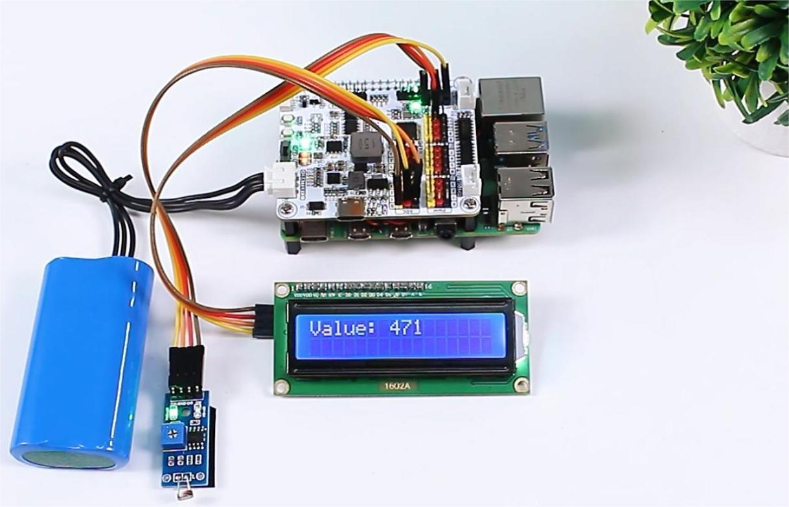

# Read a photoresistor

Connect the sensor to a valid ADC input and create one `XWalkAdc` object from the
shared `XWalkI2c` dependency.

## Image: Photoresistor connection

Read the raw count or converted voltage, apply application-owned calibration,
and send the result to an independently owned display or trace backend. The
current xWalk HAL does not provide an LCD-specific driver.
