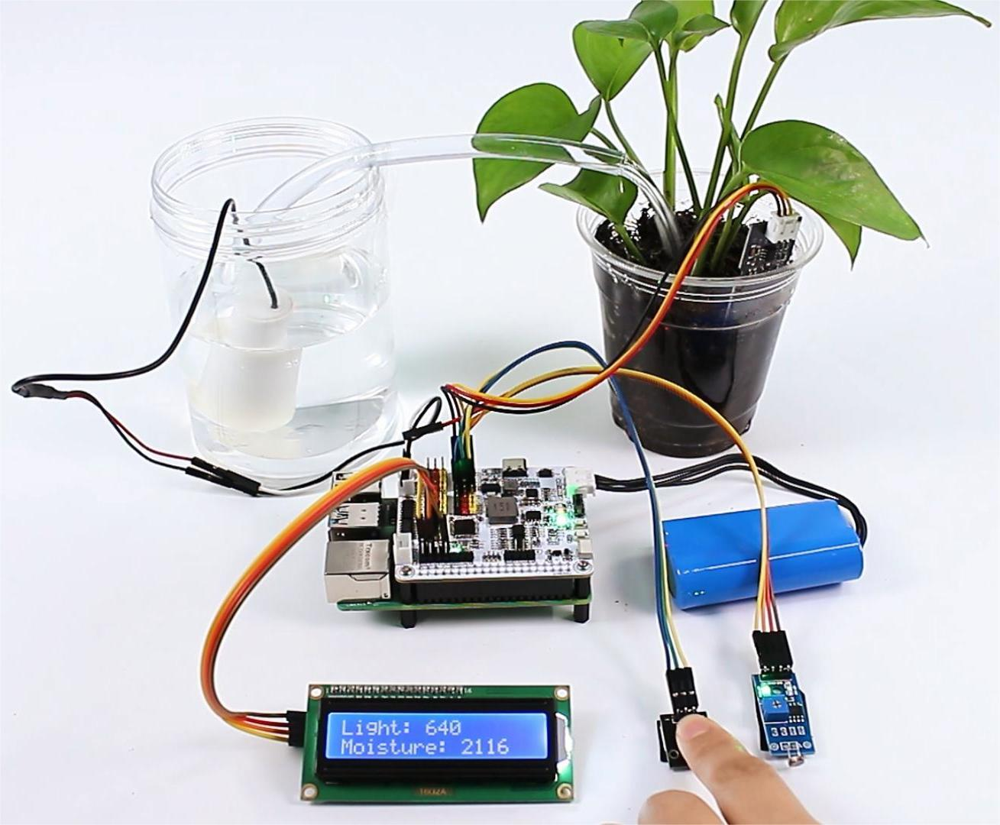

# C++ plant monitor

Use separate `XWalkAdc` objects for light and moisture, `XWalkUserButton` for
the user action, and `XWalkGpio` or a suitable motor driver for pump control.

## Image: Plant-monitor arrangement

The application must define valid sensor ranges, maximum pump-on time, minimum
pump-off time, display behavior, and a shutdown path that always disables the
pump. Do not perform blocking application work in a button interrupt callback.
