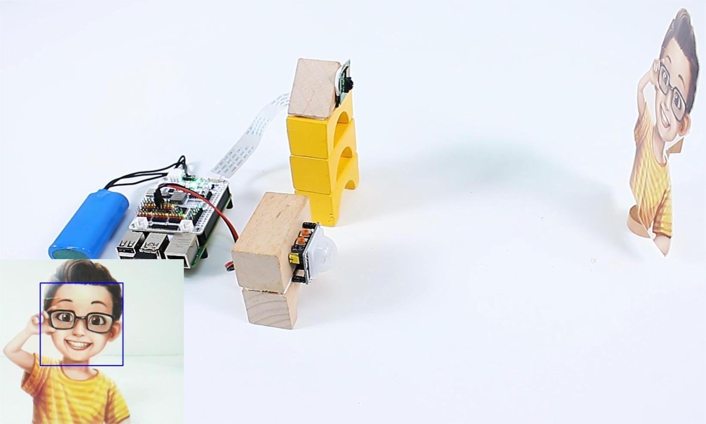

# C++ security-system composition

Use `XWalkGpio` to report PIR state or edges. Schedule camera capture and face
recognition outside the GPIO callback. Use `XWalkTextToSpeech` or
`XWalkVoiceAssistant` only from an application execution context.

## Image: Security-system hardware

## Image: C++ application status screen

TODO: Add a C++ application screenshot after the user interface is implemented.

The application owns camera resources, models, personal-data policy, files, and
network activity. No such operation is permitted inside an interrupt handler.
