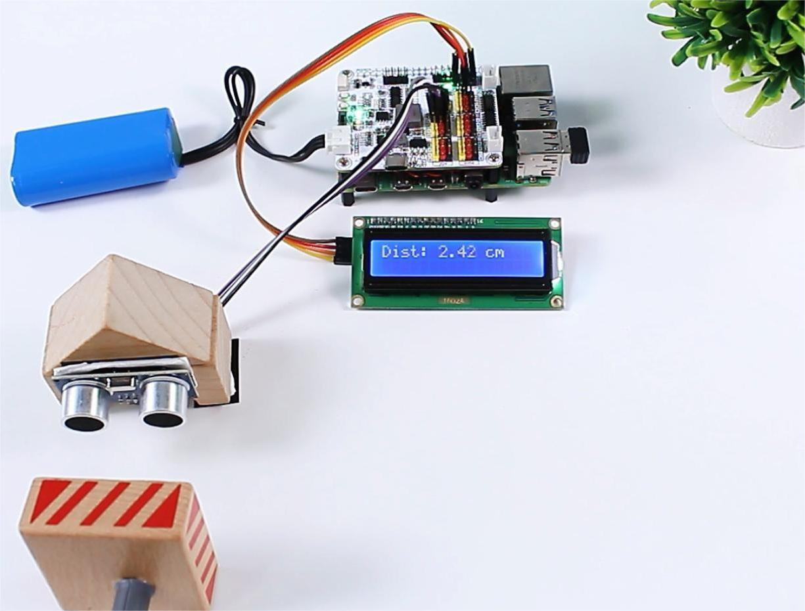

# Read ultrasonic distance

Create separate trigger and echo `XWalkGpio` objects and pass them to
`XWalkUltrasonic`.

## Image: Ultrasonic connection

Successful results are expressed in centimetres. Do not interpret timeout as
zero distance. A moving robot should enter a safe state after repeated timeout
or invalid-pulse results. An optional display remains application-owned.
