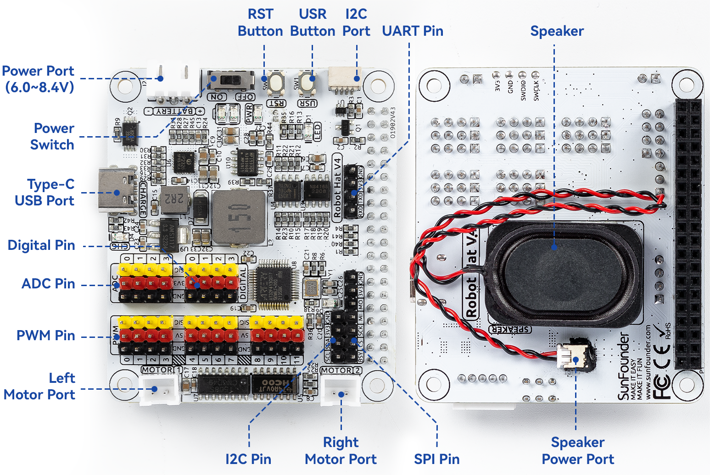

# xWalk C++ Documentation Index

This index links the current C++ architecture and module documentation. Module-specific contracts, build
options, backend ownership, safety constraints, and verification commands remain in each module README.

## Workspace architecture

- [xWalk common library](../xWalkLibrary/common/README.md): shared interface target for public headers in
  `xWalkLibrary/common`.
- [xWalkHal](../xWalkHal/README.md): aggregate hardware-abstraction architecture and build options.
- [xWalkAgent](../xWalkAgent/README.md): application coordinators and aggregate Agent verification.
- [xWalkController](../xWalkController/README.md): standalone CLI aggregate and Controller composition.
- [High-level architecture](Doc/note/HAL%20Arcithure.md): workspace layers and ownership rules.
- [Hardware architecture](Doc/note/HAL%20Hardware%20Architecture.md): devices and backends.
- [CLI architecture](Doc/note/CLI%20Architecture.md): command coverage and implementation plan.
- [Raspberry Pi deployment guide](Doc/note/Deployment%20Guide.md): install layout, idempotent setup, board-profile
  checks, and narrowly scoped device permissions.
- [CMake dependency guide](Doc/note/Dependency%20Installer%20Guide.md): external libraries, imported targets,
  build-mode requirements, package names, and discovery troubleshooting.
- [xWalkTool overview](Doc/note/xWalkTool%20Overview.md): tool inventory, safety classes, and detailed links.
- [Device Tree overlay guide](Doc/note/Device%20Tree%20Overlay%20Assets%20Guide.md): asset roles and inspection.
- [Release acceptance checklist](Doc/note/Release%20Acceptance%20Checklist.md): independent host, ARM package,
  plug-and-run, and physical-safety evidence gates.
- [Host production readiness work](Doc/note/Host%20Production%20Readiness%20Work.md): host sanitizer, stress,
  coverage, clean-environment, and staged-install verification.
- [Language-model provider configuration](Doc/note/Language%20Model%20Provider%20Configuration.md): Ollama,
  ChatGPT, Gemini, Claude, credential handling, and model selection.
- [Licence-key workflow](Doc/note/License%20Key%20Workflow.md): authenticated encryption, protected input,
  environment loading, deployment, and secret-handling boundaries.
- [Audio resources](../xWalkAudioResources/README.md): combined sound-effect and background-music assets,
  provenance, layout, and integrity hashes.

## Scripts

- [Clean build script guide](Doc/note/Clean%20Build%20Script%20Guide.md): safe discovery, preview, confirmation,
  and removal of generated CMake and Python output.
- [Dependency installer script flags](Doc/note/Dependency%20Installer%20Script%20Flags.md): complete option,
  default, compatibility alias, combination, and exit-status reference.
- [Eclipse build script guide](Doc/note/Eclipse%20Build%20Script%20Guide.md): host configuration, compilation
  database generation, build, and clean behavior.
- [Hardware provisioning script guide](Doc/note/Hardware%20Provisioning%20Script%20Guide.md): Robot HAT profile
  and Linux device validation with configuration persistence.
- [Host coverage script guide](Doc/note/Host%20Coverage%20Script%20Guide.md): foreground configure, build, test,
  coverage reporting, and enforced thresholds.
- [Raspberry Pi setup script guide](Doc/note/Raspberry%20Pi%20Setup%20Script%20Guide.md): safe dry-run, target
  validation, privileged apply behavior, and troubleshooting.
- [xWalk licence tool guide](Doc/note/xWalk%20Licence%20Tool%20Guide.md): protected input, authenticated
  encryption, serial generation, decryption, output, and exit behavior.
- [xWalk environment loader guide](Doc/note/xWalk%20Environment%20Loader%20Guide.md): sourced-shell loading,
  template validation, temporary-file cleanup, and environment security.

## Robot HAT board diagram

The diagram identifies the Robot HAT power, motor, PWM, ADC, digital, I2C, SPI, UART, button, and speaker
connections. See [Hardware introduction](Doc/note/Hardware%20Introduction.md) for the corresponding hardware
notes.

## Agent modules

- [xWalkHandler](../xWalkController/xWalkHandler/README.md): controller contract, parsing, and command handlers.
- [xWalkApp](../xWalkController/xWalkApp/README.md): executable targets, process entry points, generated help,
  application tests, and Raspberry Pi composition.
- [Controller command flow](Doc/note/Controller%20Command%20Flow.md): Mermaid traces from every CLI
  command through boot selection, typed handlers, Agent and HAL services, and final endpoints.
- [xWalkBoot](../xWalkAgent/xWalkPlatform/xWalkBoot/README.md): host stub and RPi process hardware ownership.
- [xWalkLineTracking](../xWalkAgent/xWalkVehicle/xWalkLineTracking/README.md): bounded line following.
- [xWalkPicarx](../xWalkAgent/xWalkVehicle/xWalkPicarx/README.md): movement, calibration, and sensing.
- [xWalkSelfDrive](../xWalkAgent/xWalkVehicle/xWalkSelfDrive/README.md): gestures, sounds, and action queue.
- [xWalkSpiTransfer](../xWalkAgent/xWalkConnectivity/xWalkSpiTransfer/README.md): bounded SPI transactions.
- [xWalkVoiceActiveCar](../xWalkAgent/xWalkVoice/xWalkVoiceActiveCar/README.md): sensor-aware voice car.
- [xWalkGptCar](../xWalkAgent/xWalkVoice/xWalkGptCar/README.md): upstream JSON GPT-car assistant.

## HAL modules

- [xWalkAdc](../xWalkHal/xWalkAdc/README.md): Robot HAT analog-to-digital conversion.
- [xWalkAdxl345](../xWalkHal/xWalkAdxl345/README.md): ADXL345 acceleration sensing.
- [xWalkAudio](../xWalkHal/xWalkAudio/README.md): shared ALSA PCM, mixer, and device ownership.
- [xWalkBoardControl](../xWalkHal/xWalkBoardControl/README.md): board reset, discovery, and firmware data.
- [xWalkBuzzer](../xWalkHal/xWalkBuzzer/README.md): active and passive buzzer control.
- [xWalkConfig](../xWalkHal/xWalkConfig/README.md): configuration parsing and persistence.
- [xWalkGpio](../xWalkHal/xWalkGpio/README.md): GPIO abstraction and Linux backend.
- [xWalkGPT](../xWalkHal/xWalkGPT/README.md): speech coordination plus Vosk and Espeak providers.
- [xWalkI2c](../xWalkHal/xWalkI2c/README.md): I2C abstraction and Linux backend.
- [xWalkIW](../xWalkIW/README.md): I2C and Controller Protobuf DTOs and typed gRPC services.
- [xWalkLanguageModel](../xWalkHal/xWalkLanguageModel/README.md): provider-neutral language-model access.
- [xWalkLed](../xWalkHal/xWalkLed/README.md): GPIO and PWM LED control.
- [xWalkLineTracker](../xWalkHal/xWalkLineTracker/README.md): grayscale line-position estimation.
- [xWalkMotor](../xWalkHal/xWalkMotor/README.md): single and paired motor control.
- [xWalkMusic](../xWalkHal/xWalkMusic/README.md): musical tones and injected audio playback.
- [xWalkPwm](../xWalkHal/xWalkPwm/README.md): Robot HAT PWM output.
- [xWalkRobot](../xWalkHal/xWalkRobot/README.md): coordinated multi-servo robot control.
- [xWalkServo](../xWalkHal/xWalkServo/README.md): calibrated servo positioning.
- [xWalkSpeaker](../xWalkHal/xWalkSpeaker/README.md): decoded audio-file playback.
- [xWalkSpi](../xWalkHal/xWalkSpi/README.md): bounded SPI abstraction and Linux backend.
- [xWalkTrace](../xWalkHal/xWalkTrace/README.md): filtered callback-based diagnostics.
- [xWalkUltrasonic](../xWalkHal/xWalkUltrasonic/README.md): ultrasonic distance measurement.
- [xWalkUserButton](../xWalkHal/xWalkUserButton/README.md): button events and press timing.
- [xWalkUtils](../xWalkHal/xWalkUtils/README.md): platform utilities and bounded lazy caching.
- [xWalkVoiceAssistant](../xWalkHal/xWalkVoiceAssistant/README.md): speech and model backend composition.

## Safety and verification

Use host tests for ordinary verification. Raspberry Pi hardware tests are opt-in and must only run when the
correct Raspberry Pi and Robot HAT are connected, the robot is secured, and physical execution is approved.
Use `ctest -N -L hardware` to list hardware tests without executing them.
